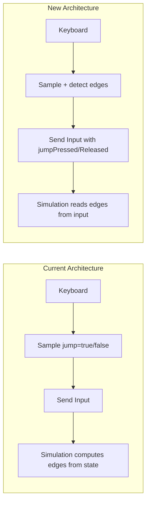

# Client-Side Input Edge Detection

## Problem

The current architecture computes input edges (`jumpPressed`, `jumpReleased`) inside the simulation by comparing `input.jump` against `state.jumpWasPressedLastFrame`. This fails during reconciliation because historical inputs may contain `jump: false` values, causing spurious `jumpReleased` events that reset `jumpConsumedWhileHeld`, leading to unwanted jumps when landing.

## Solution

Move edge detection to the client's input sampling layer. The client is the only entity that truly knows "this is a new key press" vs "this is a continuation." The simulation simply reads the edges from the input.



## Files to Modify

### 1. Input Types - [examples/rounds/types.ts](examples/rounds/types.ts)

Add edge fields to `RoundsInput`:

```typescript
export interface RoundsInput {
  moveX: number;
  jump: boolean;           // Is jump currently held?
  jumpPressed: boolean;    // NEW: Rising edge (just pressed this sample)
  jumpReleased: boolean;   // NEW: Falling edge (just released this sample)
  shoot: boolean;
  // ... rest unchanged
}
```

Update `createIdleInput` to include the new fields with `false` defaults.

### 2. Client Input Sampling - [examples/rounds/app/src/game/game-client.ts](examples/rounds/app/src/game/game-client.ts)

Add client-side edge detection state and logic:

```typescript
private lastSentJumpState: boolean = false;

private sendCurrentInput(): void {
  const jump = this.keys.has(" ") || this.keys.has("w") || this.keys.has("arrowup");
  
  // Edge detection at the source
  const jumpPressed = jump && !this.lastSentJumpState;
  const jumpReleased = !jump && this.lastSentJumpState;
  this.lastSentJumpState = jump;

  this.netcodeClient.sendInput({
    moveX,
    jump,
    jumpPressed,
    jumpReleased,
    // ... other fields
  });
}
```

### 3. Platformer Types - [packages/platformer/src/types.ts](packages/platformer/src/types.ts)

- Remove `jumpWasPressedLastFrame` from `PlayerMovementState`
- Remove `jumpConsumedWhileHeld` from `PlayerMovementState` 
- Add `jumpPressed` and `jumpReleased` to `PlatformerMovementInput`

### 4. Movement Logic - [packages/platformer/src/movement.ts](packages/platformer/src/movement.ts)

Replace edge computation with direct input reads:

```typescript
// REMOVE these lines:
const jumpPressed = input.jump && !state.jumpWasPressedLastFrame;
const jumpReleased = !input.jump && state.jumpWasPressedLastFrame;

// REPLACE with:
const jumpPressed = input.jumpPressed;
const jumpReleased = input.jumpReleased;
```

Remove `jumpConsumedWhileHeld` tracking - this is now the client's responsibility.

Update the return statement to remove `jumpWasPressedLastFrame` and `jumpConsumedWhileHeld`.

### 5. Rounds Player State - [examples/rounds/types.ts](examples/rounds/types.ts) (Player)

Remove `jumpWasPressedLastFrame` and `jumpConsumedWhileHeld` from player state in `createRoundsPlayer`.

### 6. Prediction Scope - [examples/rounds/prediction.ts](examples/rounds/prediction.ts)

- Remove `ClientInputState` interface
- Remove `preservedClientInputState` singleton
- Remove `preserveClientState` function
- Remove all instrumentation logging related to input state preservation
- Remove `preserveClientState` from `roundsPredictionScope` export

### 7. Netcode Reconciler - [packages/netcode/src/client/reconciliation.ts](packages/netcode/src/client/reconciliation.ts)

- Remove the call to `this.predictionScope.preserveClientState`

### 8. Netcode Prediction Scope - [packages/netcode/src/client/prediction-scope.ts](packages/netcode/src/client/prediction-scope.ts)

- Remove `preserveClientState` from the `PredictionScope` interface

### 9. Server-Authoritative Strategy - [packages/netcode/src/strategies/server-authoritative.ts](packages/netcode/src/strategies/server-authoritative.ts)

- Remove any calls to `preserveClientState`

### 10. Tests

Update tests in:

- [packages/platformer/src/movement.test.ts](packages/platformer/src/movement.test.ts) - Update to use `jumpPressed`/`jumpReleased` in inputs
- [examples/rounds/simulation.test.ts](examples/rounds/simulation.test.ts) - Update input structures

## Cleanup

Remove all `#region agent log` instrumentation blocks added during debugging from:

- `movement.ts`
- `game-client.ts`
- `prediction.ts`
- `reconciliation.ts`