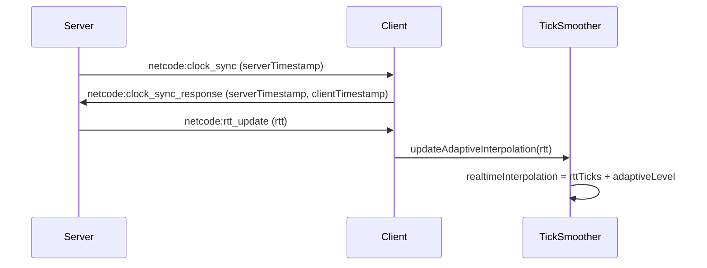

# FishNet-Style Adaptive Interpolation

## Problem

The current `TickSmoother` uses fixed interpolation ticks (1 for owner, 2 for spectators). When network jitter exceeds this buffer (~16-33ms at 60 TPS), the buffer runs dry and movement pauses, causing visible stuttering. This is especially problematic over higher-latency connections like Cloudflare tunnels.

## Solution

Implement FishNet's adaptive interpolation approach:

1. Measure RTT on the client via server-initiated clock sync
2. Convert RTT to ticks and add a configurable buffer offset
3. Dynamically update the smoother's interpolation target
4. Apply reconciliation easing to smooth corrections into the buffer

## Architecture



## Changes

### 1. Add RTT broadcast from server to client

**File**: [packages/netcode/src/create-server.ts](packages/netcode/src/create-server.ts)

After calculating RTT in the clock sync response handler (line 366), emit the RTT back to the client:

```typescript
socket.emit("netcode:rtt_update", { rtt });
```

### 2. Add adaptive interpolation types and config

**File**: [packages/netcode/src/client/tick-smoother.ts](packages/netcode/src/client/tick-smoother.ts)

Add adaptive interpolation level enum (matching FishNet):

```typescript
export enum AdaptiveInterpolationLevel {
  Off = 0,
  VeryLow = 1,    // +1 tick buffer
  Low = 2,        // +2 ticks buffer
  Moderate = 3,   // +3 ticks buffer
  High = 4,       // +4 ticks buffer
  VeryHigh = 5,   // +5 ticks buffer
}
```

Add config options:

- `adaptiveInterpolation: AdaptiveInterpolationLevel` (default: `Low`)
- Remove fixed `ownerInterpolationTicks` / `spectatorInterpolationTicks` when adaptive is enabled

### 3. Implement adaptive interpolation calculation

**File**: [packages/netcode/src/client/tick-smoother.ts](packages/netcode/src/client/tick-smoother.ts)

Add method to update interpolation based on RTT (FishNet formula):

```typescript
updateAdaptiveInterpolation(rttMs: number): void {
  if (this.config.adaptiveInterpolation === AdaptiveInterpolationLevel.Off) {
    return;
  }
  
  // Convert RTT to ticks + 1 (FishNet formula)
  const rttTicks = Math.ceil(rttMs / this.config.tickIntervalMs) + 1;
  
  // Add adaptive level as minimum buffer
  const interpolation = rttTicks + this.config.adaptiveInterpolation;
  
  // Clamp to reasonable bounds
  const clamped = Math.min(interpolation, Math.floor(1000 / this.config.tickIntervalMs));
  
  // Hysteresis: only update if changed by more than 1 tick
  if (this.realtimeInterpolation === 0 || Math.abs(this.realtimeInterpolation - clamped) > 1) {
    this.realtimeInterpolation = clamped;
  }
}
```

Replace `interpolationTicks` usage with `realtimeInterpolation` throughout the class.

### 4. Handle RTT updates in client strategy

**File**: [packages/netcode/src/strategies/server-authoritative.ts](packages/netcode/src/strategies/server-authoritative.ts)

Add method to propagate RTT updates to all smoothers:

```typescript
onRttUpdate(rttMs: number): void {
  this.localPlayerSmoother.updateAdaptiveInterpolation(rttMs);
  for (const smoother of this.remotePlayerSmoothers.values()) {
    smoother.updateAdaptiveInterpolation(rttMs);
  }
}
```

### 5. Wire up RTT event in client factory

**File**: [packages/netcode/src/create-client.ts](packages/netcode/src/create-client.ts)

Add handler for `netcode:rtt_update` event:

```typescript
const handleRttUpdate = (data: { rtt: number }) => {
  strategy.onRttUpdate(data.rtt);
};

socket.on("netcode:rtt_update", handleRttUpdate);
```

Add cleanup in `destroy()`.

### 6. Add smoothing config to client factory

**File**: [packages/netcode/src/create-client.ts](packages/netcode/src/create-client.ts)

Expose adaptive interpolation level in `SmoothingConfig`:

```typescript
interface SmoothingConfig {
  adaptiveInterpolation?: AdaptiveInterpolationLevel;
  // Keep fixed values as fallback when adaptive is off
  ownerInterpolationTicks?: number;
  spectatorInterpolationTicks?: number;
  teleportThreshold?: number;
}
```

### 7. Implement reconciliation easing (optional enhancement)

**File**: [packages/netcode/src/client/tick-smoother.ts](packages/netcode/src/client/tick-smoother.ts)

Add method to ease corrections into existing queue entries (FishNet's `ModifyTransformProperties`):

```typescript
easeCorrection(tick: number, newX: number, newY: number): void {
  const index = this.queue.findIndex(entry => entry.tick === tick);
  if (index < 0) return;
  
  const queueCount = this.queue.length;
  const adjustedQueueCount = Math.max(1, queueCount - 2);
  const easePercent = Math.pow(index / adjustedQueueCount, adjustedQueueCount - index);
  
  const old = this.queue[index];
  this.queue[index] = {
    tick,
    x: old.x + (newX - old.x) * easePercent,
    y: old.y + (newY - old.y) * easePercent,
  };
}
```

Wire this into the reconciliation replay callback instead of adding new entries.

## Testing

1. Run rounds example locally - should see smooth movement
2. Add simulated latency via `setSimulatedLatency(100)` - should still be smooth
3. Test via Cloudflare tunnel - should handle jitter without stuttering
4. Verify adaptive interpolation updates when RTT changes

## Backwards Compatibility

- Default `adaptiveInterpolation: AdaptiveInterpolationLevel.Low` provides automatic buffer adjustment
- Setting `AdaptiveInterpolationLevel.Off` falls back to fixed interpolation ticks
- Existing code that doesn't pass smoothing config will get improved behavior automatically