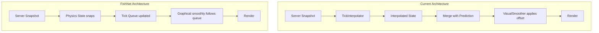

# FishNet-Style Unified Tick Smoothing

## Problem Statement

Our current architecture has two separate smoothing systems:

1. `TickInterpolator` - buffers server snapshots, interpolates between ticks
2. `VisualSmoother` - applies position offset after reconciliation snaps

This is more complex than necessary and doesn't match FishNet's proven approach. FishNet uses a single unified system where:

- Physics state can "teleport" during reconciliation
- Graphical representation smoothly interpolates through a queue of tick-indexed positions
- During reconciliation replay, queue entries are directly modified with eased corrections

## Architecture Comparison



## Key Changes

### 1. New `TickSmoother` Class (replaces both TickInterpolator and VisualSmoother)

A single class that:

- Maintains a queue of `{tick, position, rotation?}` entries
- Interpolates the graphical position toward the queue front
- Directly modifies queue entries during reconciliation replay (ease-in corrections)
- Supports different interpolation ticks for owner (1) vs spectator (2)

Key methods:

- `onPhysicsTick(tick, position)` - Add new position after physics tick
- `onReconciliationReplay(tick, correctedPosition)` - Modify queue entry with ease-in
- `getSmoothedPosition(deltaMs)` - Get interpolated position for rendering
- `setInterpolationTicks(ticks)` - Switch between owner/spectator mode

### 2. Separate Physics State from Render State

Current: `getStateForRendering()` returns world state with offsets baked in

New approach:

- Physics state (what reconciliation/prediction operates on) stays pure
- `TickSmoother` maintains graphical position separately
- Renderer receives physics state + per-entity smoothed offsets

### 3. Simplified Reconciliation Flow

Current flow:

1. Reconciliation snaps physics state
2. Capture position delta
3. Feed delta to VisualSmoother
4. VisualSmoother decays offset over time
5. Apply offset to rendered position

New flow (FishNet-style):

1. During reconciliation replay, for each tick:

   - Update physics state
   - Call `tickSmoother.onReconciliationReplay(tick, newPosition)`
   - TickSmoother modifies queue entry with exponential ease-in

2. Graphical position automatically smooths via queue consumption

### 4. Per-Entity Smoothing (Future-Ready)

FishNet smooths individual transforms, not entire world states. For now, we smooth the local player's position only, but the architecture allows extending to per-entity smoothing later.

## Files to Delete

- [packages/netcode/src/client/visual-smoother.ts](packages/netcode/src/client/visual-smoother.ts) - Replaced by TickSmoother
- [packages/netcode/src/client/visual-smoother.test.ts](packages/netcode/src/client/visual-smoother.test.ts)
- [packages/netcode/src/client/tick-interpolator.ts](packages/netcode/src/client/tick-interpolator.ts) - Replaced by TickSmoother
- [packages/netcode/src/client/tick-interpolator.test.ts](packages/netcode/src/client/tick-interpolator.test.ts)

## Files to Create

- `packages/netcode/src/client/tick-smoother.ts` - New unified smoothing system
- `packages/netcode/src/client/tick-smoother.test.ts` - Tests for new system

## Files to Modify

- [packages/netcode/src/client/reconciliation.ts](packages/netcode/src/client/reconciliation.ts) - Simplify callback to just pass tick + position
- [packages/netcode/src/strategies/server-authoritative.ts](packages/netcode/src/strategies/server-authoritative.ts) - Use TickSmoother instead of dual system
- [packages/netcode/src/client/index.ts](packages/netcode/src/client/index.ts) - Export TickSmoother
- [packages/netcode/src/index.ts](packages/netcode/src/index.ts) - Update exports
- [packages/netcode/src/constants.ts](packages/netcode/src/constants.ts) - Add owner/spectator interpolation constants
- [packages/netcode/src/create-client.ts](packages/netcode/src/create-client.ts) - Update config types
- [packages/netcode/src/client/prediction-scope.ts](packages/netcode/src/client/prediction-scope.ts) - Remove `applyVisualOffset`, keep `getLocalPlayerPosition`

## TickSmoother Implementation Sketch

```typescript
interface TickPosition {
  tick: number;
  x: number;
  y: number;
}

interface TickSmootherConfig {
  ownerInterpolationTicks: number;    // Default: 1
  spectatorInterpolationTicks: number; // Default: 2
  tickIntervalMs: number;
  maxOverBuffer: number;               // Default: 3
}

class TickSmoother {
  private queue: TickPosition[] = [];
  private currentX: number = 0;
  private currentY: number = 0;
  private movementMultiplier: number = 1.0;
  private interpolationTicks: number;
  private tickProgress: number = 0;
  
  // Called after each physics tick with the new authoritative position
  onPhysicsTick(tick: number, x: number, y: number): void {
    this.queue.push({ tick, x, y });
    this.discardExcess();
    this.updateMovementMultiplier();
  }
  
  // Called during reconciliation replay - modifies queue entries with ease-in
  onReconciliationReplay(tick: number, x: number, y: number): void {
    const index = this.queue.findIndex(e => e.tick === tick);
    if (index < 0) return;
    
    // Ease-in: entries further in queue get more correction
    const queueLength = this.queue.length;
    const adjustedLength = Math.max(1, queueLength - 2);
    let easePercent = index / adjustedLength;
    
    // Exponential ease for smoother transitions
    if (easePercent < 1.0) {
      easePercent = Math.pow(easePercent, adjustedLength - index);
    }
    easePercent = Math.min(1.0, easePercent);
    
    // Lerp old position toward corrected position
    const old = this.queue[index];
    this.queue[index] = {
      tick,
      x: old.x + (x - old.x) * easePercent,
      y: old.y + (y - old.y) * easePercent,
    };
  }
  
  // Get smoothed position for rendering
  getSmoothedPosition(deltaMs: number): { x: number; y: number } {
    // Advance through queue based on deltaMs and movementMultiplier
    // Interpolate between current queue entry and next
    // Return smoothed position
  }
  
  // Switch between owner (1 tick) and spectator (2 ticks) mode
  setIsOwner(isOwner: boolean): void {
    this.interpolationTicks = isOwner 
      ? this.config.ownerInterpolationTicks 
      : this.config.spectatorInterpolationTicks;
  }
}
```

## Integration with ServerAuthoritativeClient

```typescript
class ServerAuthoritativeClient {
  private tickSmoother: TickSmoother;
  private physicsState: TWorld | null = null;
  
  onSnapshot(snapshot: Snapshot<TWorld>): void {
    // Update physics state
    this.physicsState = snapshot.state;
    
    // Get local player position and add to smoother queue
    if (this.playerId) {
      const pos = this.predictionScope.getLocalPlayerPosition(snapshot.state, this.playerId);
      if (pos) {
        this.tickSmoother.onPhysicsTick(snapshot.tick, pos.x, pos.y);
      }
    }
    
    // Reconcile (this will call onReconciliationReplay for each replayed tick)
    if (this.reconciler) {
      this.reconciler.reconcile(snapshot);
    }
  }
  
  getStateForRendering(deltaMs: number): TWorld | null {
    if (!this.physicsState || !this.playerId) return this.physicsState;
    
    // Get smoothed position
    const smoothed = this.tickSmoother.getSmoothedPosition(deltaMs);
    
    // Apply smoothed position to physics state for rendering
    // (creates a copy, doesn't mutate physics state)
    return this.applySmoothedPosition(this.physicsState, this.playerId, smoothed);
  }
}
```

## Test Strategy

New tests for `TickSmoother`:

1. Queue management (add, discard excess, maintain order)
2. Movement multiplier (speeds up when full, slows when empty)
3. Ease-in corrections (verify exponential lerp during replay)
4. Owner vs spectator interpolation switching
5. Edge cases (empty queue, single entry, very large deltas)

Integration tests can be adapted from existing tests once the new architecture is in place.

## Migration Path

1. Create `TickSmoother` with tests
2. Update `ServerAuthoritativeClient` to use `TickSmoother`
3. Update `Reconciler` to call smoother during replay
4. Remove `applyVisualOffset` from `PredictionScope`
5. Delete old files (`VisualSmoother`, `TickInterpolator`)
6. Update exports and constants
7. Update examples if needed (should mostly work since `getStateForRendering` API stays the same)