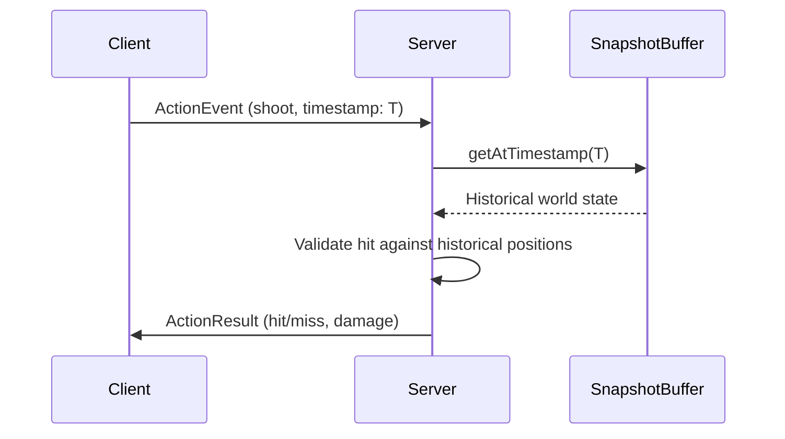

# Lag Compensation for Hit Detection

## Overview

When a client shoots, they see other players in the past (due to interpolation delay). Lag compensation lets the server rewind time to validate hits against where targets *actually were* from the shooter's perspective.

## Architecture

## Key Components

### 1. Action Event System

- Define `ActionMessage<TAction>` type in [`core/types.ts`](packages/netcode/src/core/types.ts)
- Add action queue to server (similar to input queue)
- Actions include: type, target position/direction, client timestamp

### 2. Server-Side Hit Validation

- New `LagCompensator` class that:
  - Takes an action + timestamp
  - Retrieves historical snapshot via existing `SnapshotBuffer.getAtTimestamp()`
  - Performs hit detection against historical positions
  - Returns validation result

### 3. Client Integration

- Add `sendAction(action)` to [`NetcodeClientHandle`](packages/netcode/src/create-client.ts)
- Actions are separate from inputs (inputs = movement, actions = discrete events)

### 4. Platformer Example

- Add simple "attack" action with hitbox
- Visualize hit detection in debug renderer

## Considerations

- **Maximum rewind time**: Cap how far back server will rewind (e.g., 200ms) to prevent abuse
- **Interpolation awareness**: Client timestamp should account for their interpolation delay
- **Hit priority**: When multiple clients shoot simultaneously, use server-received timestamp as tiebreaker (first processed wins). For truly simultaneous hits, use client ID as deterministic tiebreaker.
- **Action message format**: `ActionMessage<TAction>` should include monotonic `seq` number and `clientTimestamp`. Server deduplicates by `(clientId, seq)` before processing.
- **Network reliability**: Actions use reliable transport (Socket.IO events / WebTransport streams). Server sends `ActionResult` ack. Client can retry unacked actions with same `seq` (server ignores duplicates via idempotency check).