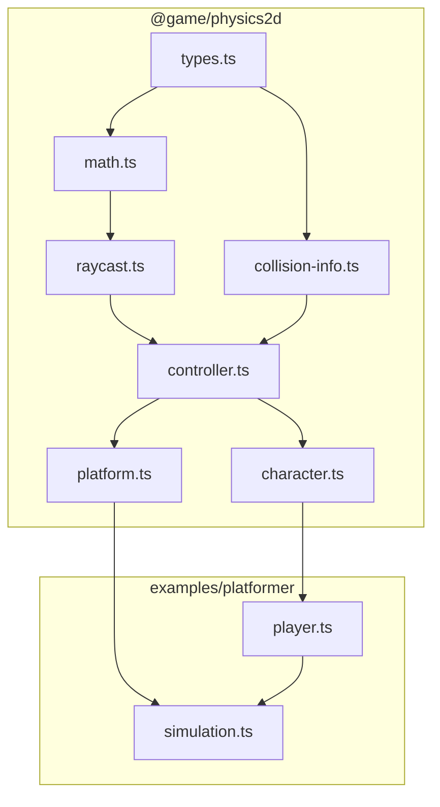

# Lague-Style 2D Character Controller

## Philosophy

This is foundational infrastructure. The character controller will be used by every 2D game built on this engine. It must be:

- **Correct** - Physics math is documented and derived from first principles
- **Composable** - Low-level primitives (raycast, collision) usable independently  
- **Testable** - Pure functions, no hidden state, deterministic results
- **Documented** - Future maintainers understand *why*, not just *what*

## Architecture

Create a new package for 2D physics primitives, separate from game-specific logic:

```
packages/
├── netcode/           # Networking (existing)
├── physics2d/         # NEW: 2D physics primitives
│   ├── src/
│   │   ├── index.ts
│   │   ├── types.ts           # Core types (Vector2, AABB, Ray, RaycastHit)
│   │   ├── math.ts            # Vector math, trigonometry helpers
│   │   ├── raycast.ts         # Raycast against geometry
│   │   ├── collision-info.ts  # CollisionInfo type and helpers
│   │   ├── controller.ts      # RaycastController (base collision logic)
│   │   ├── character.ts       # CharacterController2D (movement + slopes)
│   │   └── platform.ts        # MovingPlatform logic
│   ├── package.json
│   ├── tsconfig.json
│   └── README.md

examples/platformer/
├── player.ts          # NEW: Game-specific player logic (jump, wall slide)
├── simulation.ts      # REFACTOR: Uses @game/physics2d
├── types.ts           # Game-specific types only (combat, projectiles)
└── ...
```


The layering is intentional:

- **Layer 0**: `types.ts` - Zero dependencies, just type definitions
- **Layer 1**: `math.ts` - Vector operations, only depends on types
- **Layer 2**: `raycast.ts`, `collision-info.ts` - Independent utilities
- **Layer 3**: `controller.ts` - Combines raycast + collision info
- **Layer 4**: `character.ts`, `platform.ts` - High-level abstractions

Each layer only imports from layers below it. No circular dependencies.

## Key Concepts from Lague

### 1. Raycast-Based Collision

Instead of checking AABB overlap after movement, cast rays in the direction of movement to detect collisions **before** they happen.

```
Traditional AABB:          Raycast-based:
┌───┐                      ┌───┐
│ P │──move──>║            │ P │--ray-->║  (detect wall)
└───┘         ║            └───┘        ║
      ┌───┐   ║                  ┌───┐  ║
      │ P │<──║ (overlap!)       │ P │  ║  (stop at wall)
      └───┘   ║                  └───┘  ║
```

Key parameters:

- **Skin width** (0.015 units) - Small inset from collider edges prevents numerical issues
- **Multiple rays** - Cast several rays along each edge for accurate detection  
- **Separate X/Y passes** - Handle horizontal movement first, then vertical

### 2. Slope Handling

The math for slopes uses trigonometry to convert horizontal velocity into diagonal movement:

```
Climbing slope:                    Descending slope:
       /│                          ────┐
      / │ climbY = sin(θ) * dist       │\
     /  │                              │ \
    /θ──┴─                             │  \
    moveX = cos(θ) * dist              descendY = -sin(θ) * dist
```

- **Max slope angle** (80°) - Steeper slopes become walls
- **Slope normal** - Used to determine push direction when sliding

### 3. Variable Jump Height

Gravity and jump velocity are **derived** from desired feel, not tuned randomly:

```typescript
/**
 * Given:
 *   maxJumpHeight - How high the player jumps when holding jump
 *   timeToJumpApex - How long it takes to reach the peak
 * 
 * Derive:
 *   gravity = -(2 * maxJumpHeight) / (timeToJumpApex²)
 *   maxJumpVelocity = |gravity| * timeToJumpApex
 * 
 * For variable jump (tap vs hold):
 *   minJumpVelocity = sqrt(2 * |gravity| * minJumpHeight)
 * 
 * When player releases jump early, clamp velocity to minJumpVelocity
 */
```

This ensures the jump arc is **physically correct** - the math guarantees the player reaches exactly `maxJumpHeight` in exactly `timeToJumpApex` seconds.

### 4. Wall Mechanics

Wall sliding and jumping add significant game feel:

- **Wall sliding** - When falling against a wall, cap fall speed to `wallSlideSpeedMax`
- **Wall stick time** - Brief delay (0.25s) before player can leave wall (prevents accidental detach)
- **Three wall jump types** based on input direction relative to wall:
                                                                                                                                                                                                                                                                                                                                                                                                                                                                                                                                - **Climb** (pressing toward wall) - Small hop, stay on wall
                                                                                                                                                                                                                                                                                                                                                                                                                                                                                                                                - **Hop off** (neutral) - Medium jump away from wall
                                                                                                                                                                                                                                                                                                                                                                                                                                                                                                                                - **Leap** (pressing away) - Large jump in opposite direction

### 5. One-Way Platforms

Platforms tagged as "through" have special collision rules:

- Ignore collision when player is moving **up** through platform
- Ignore collision when player presses **down** (drop through)
- Brief cooldown (0.5s) after dropping to prevent re-landing immediately

### 6. Moving Platforms

Moving platforms must move passengers correctly:

- **Detect passengers** via raycasts from platform surface
- **Move order matters** - passengers on top move *before* platform when going down, *after* when going up
- **Handle pushing** - horizontal platform movement pushes players

## Detailed File Specifications

### packages/physics2d/src/types.ts

```typescript
/**
 * 2D vector for positions, velocities, directions.
 * Immutable - all operations return new vectors.
 */
export interface Vector2 {
  readonly x: number;
  readonly y: number;
}

/**
 * Axis-Aligned Bounding Box.
 * Position is the CENTER of the box (not top-left).
 */
export interface AABB {
  readonly position: Vector2;
  readonly halfSize: Vector2;  // Half width/height for easier math
}

/**
 * A ray for raycasting.
 */
export interface Ray {
  readonly origin: Vector2;
  readonly direction: Vector2;  // Should be normalized
}

/**
 * Result of a raycast hit.
 */
export interface RaycastHit {
  readonly hit: true;
  readonly point: Vector2;      // World position of hit
  readonly normal: Vector2;     // Surface normal at hit point
  readonly distance: number;    // Distance from ray origin
  readonly collider: Collider;  // What was hit
}

export interface RaycastMiss {
  readonly hit: false;
}

export type RaycastResult = RaycastHit | RaycastMiss;

/**
 * A collider in the physics world.
 * Can be a platform, wall, or any solid geometry.
 */
export interface Collider {
  readonly id: string;
  readonly bounds: AABB;
  readonly oneWay?: boolean;    // Can pass through from below
  readonly tag?: string;        // For game-specific logic
}

/**
 * Origins for raycasts at collider corners.
 * Used by the controller to cast rays from player bounds.
 */
export interface RaycastOrigins {
  readonly topLeft: Vector2;
  readonly topRight: Vector2;
  readonly bottomLeft: Vector2;
  readonly bottomRight: Vector2;
}

/**
 * Configuration for the raycast controller.
 */
export interface ControllerConfig {
  /** Small inset to prevent getting stuck. Default: 0.015 */
  readonly skinWidth: number;
  /** Slopes steeper than this are walls. Default: 80 degrees */
  readonly maxSlopeAngle: number;
  /** Number of rays to cast horizontally. Default: 4 */
  readonly horizontalRayCount: number;
  /** Number of rays to cast vertically. Default: 4 */
  readonly verticalRayCount: number;
}

export const DEFAULT_CONTROLLER_CONFIG: ControllerConfig = {
  skinWidth: 0.015,
  maxSlopeAngle: 80,
  horizontalRayCount: 4,
  verticalRayCount: 4,
};
```

### packages/physics2d/src/math.ts

```typescript
import type { Vector2 } from "./types.js";

// Vector operations - all pure functions returning new vectors

export const vec2 = (x: number, y: number): Vector2 => ({ x, y });
export const vec2Zero: Vector2 = { x: 0, y: 0 };
export const vec2Up: Vector2 = { x: 0, y: -1 };    // Y-down coordinate system
export const vec2Down: Vector2 = { x: 0, y: 1 };
export const vec2Left: Vector2 = { x: -1, y: 0 };
export const vec2Right: Vector2 = { x: 1, y: 0 };

export const add = (a: Vector2, b: Vector2): Vector2 => 
  ({ x: a.x + b.x, y: a.y + b.y });

export const sub = (a: Vector2, b: Vector2): Vector2 => 
  ({ x: a.x - b.x, y: a.y - b.y });

export const scale = (v: Vector2, s: number): Vector2 => 
  ({ x: v.x * s, y: v.y * s });

export const dot = (a: Vector2, b: Vector2): number => 
  a.x * b.x + a.y * b.y;

export const magnitude = (v: Vector2): number => 
  Math.sqrt(v.x * v.x + v.y * v.y);

export const normalize = (v: Vector2): Vector2 => {
  const mag = magnitude(v);
  return mag > 0 ? scale(v, 1 / mag) : vec2Zero;
};

/**
 * Calculate angle between vector and up direction.
 * Returns degrees in [0, 180].
 */
export const angleFromUp = (v: Vector2): number => {
  const normalized = normalize(v);
  // dot(v, up) = cos(angle)
  const cosAngle = dot(normalized, vec2Up);
  return Math.acos(Math.max(-1, Math.min(1, cosAngle))) * (180 / Math.PI);
};

/**
 * Degrees to radians.
 */
export const degToRad = (degrees: number): number => 
  degrees * (Math.PI / 180);

/**
 * Radians to degrees.
 */
export const radToDeg = (radians: number): number => 
  radians * (180 / Math.PI);

/**
 * Linear interpolation between two values.
 */
export const lerp = (a: number, b: number, t: number): number => 
  a + (b - a) * t;

/**
 * Attempt to replicate Unity's Vector3.SmoothDamp for velocity smoothing.
 * Returns [newValue, newVelocity].
 */
export const smoothDamp = (
  current: number,
  target: number,
  currentVelocity: number,
  smoothTime: number,
  deltaTime: number,
): [number, number] => {
  // Based on Game Programming Gems 4, Chapter 1.10
  const omega = 2 / smoothTime;
  const x = omega * deltaTime;
  const exp = 1 / (1 + x + 0.48 * x * x + 0.235 * x * x * x);
  const change = current - target;
  const temp = (currentVelocity + omega * change) * deltaTime;
  const newVelocity = (currentVelocity - omega * temp) * exp;
  const newValue = target + (change + temp) * exp;
  return [newValue, newVelocity];
};
```

### packages/physics2d/src/raycast.ts

```typescript
import type { Vector2, AABB, Ray, RaycastResult, Collider } from "./types.js";
import { vec2, sub, add, scale, dot } from "./math.js";

/**
 * Cast a ray against a single AABB.
 * 
 * Algorithm: Slab intersection method
 * - For each axis, calculate the t-values where the ray enters/exits the slab
 * - The ray hits if the entry intervals overlap
 * 
 * Reference: "An Efficient and Robust Ray–Box Intersection Algorithm"
 *            Amy Williams et al., Journal of Graphics Tools 2005
 */
export function raycastAABB(
  ray: Ray,
  bounds: AABB,
): { hit: boolean; distance: number; normal: Vector2 } {
  // Calculate min/max corners from center + halfSize
  const minX = bounds.position.x - bounds.halfSize.x;
  const maxX = bounds.position.x + bounds.halfSize.x;
  const minY = bounds.position.y - bounds.halfSize.y;
  const maxY = bounds.position.y + bounds.halfSize.y;

  // Calculate inverse direction (handle division by zero)
  const invDirX = ray.direction.x !== 0 ? 1 / ray.direction.x : Infinity;
  const invDirY = ray.direction.y !== 0 ? 1 / ray.direction.y : Infinity;

  // Calculate t-values for X slab
  let tMinX = (minX - ray.origin.x) * invDirX;
  let tMaxX = (maxX - ray.origin.x) * invDirX;
  if (tMinX > tMaxX) [tMinX, tMaxX] = [tMaxX, tMinX];

  // Calculate t-values for Y slab
  let tMinY = (minY - ray.origin.y) * invDirY;
  let tMaxY = (maxY - ray.origin.y) * invDirY;
  if (tMinY > tMaxY) [tMinY, tMaxY] = [tMaxY, tMinY];

  // Check for overlap
  if (tMinX > tMaxY || tMinY > tMaxX) {
    return { hit: false, distance: 0, normal: vec2(0, 0) };
  }

  // Entry point is the later of the two entry t-values
  const tEntry = Math.max(tMinX, tMinY);
  // Exit point is the earlier of the two exit t-values  
  const tExit = Math.min(tMaxX, tMaxY);

  // Ray misses if exit is behind origin or entry is beyond ray length
  if (tExit < 0 || tEntry < 0) {
    return { hit: false, distance: 0, normal: vec2(0, 0) };
  }

  // Calculate normal based on which face was hit
  let normal: Vector2;
  if (tMinX > tMinY) {
    normal = ray.direction.x > 0 ? vec2(-1, 0) : vec2(1, 0);
  } else {
    normal = ray.direction.y > 0 ? vec2(0, -1) : vec2(0, 1);
  }

  return { hit: true, distance: tEntry, normal };
}

/**
 * Cast a ray against multiple colliders, returning the closest hit.
 */
export function raycast(
  ray: Ray,
  colliders: readonly Collider[],
  maxDistance: number,
): RaycastResult {
  let closestHit: RaycastResult = { hit: false };
  let closestDistance = maxDistance;

  for (const collider of colliders) {
    const result = raycastAABB(ray, collider.bounds);
    
    if (result.hit && result.distance < closestDistance && result.distance > 0) {
      closestDistance = result.distance;
      closestHit = {
        hit: true,
        point: add(ray.origin, scale(ray.direction, result.distance)),
        normal: result.normal,
        distance: result.distance,
        collider,
      };
    }
  }

  return closestHit;
}
```

### packages/physics2d/src/collision-info.ts

```typescript
import type { Vector2 } from "./types.js";
import { vec2Zero } from "./math.js";

/**
 * Collision state after a move operation.
 * Tracks what surfaces the controller is touching and slope information.
 */
export interface CollisionInfo {
  /** Touching ceiling */
  above: boolean;
  /** Touching ground */
  below: boolean;
  /** Touching wall on left */
  left: boolean;
  /** Touching wall on right */
  right: boolean;

  /** Currently climbing a slope */
  climbingSlope: boolean;
  /** Currently descending a slope */
  descendingSlope: boolean;
  /** Sliding down a slope that's too steep */
  slidingDownMaxSlope: boolean;

  /** Current slope angle in degrees */
  slopeAngle: number;
  /** Previous frame's slope angle (for detecting slope changes) */
  slopeAngleOld: number;
  /** Normal vector of the current slope surface */
  slopeNormal: Vector2;

  /** Movement amount from previous frame (for slope transitions) */
  moveAmountOld: Vector2;

  /** Direction the controller is facing (1 = right, -1 = left) */
  faceDir: 1 | -1;

  /** Currently falling through a one-way platform */
  fallingThroughPlatform: boolean;
}

/**
 * Create a fresh CollisionInfo with default values.
 */
export function createCollisionInfo(): CollisionInfo {
  return {
    above: false,
    below: false,
    left: false,
    right: false,
    climbingSlope: false,
    descendingSlope: false,
    slidingDownMaxSlope: false,
    slopeAngle: 0,
    slopeAngleOld: 0,
    slopeNormal: vec2Zero,
    moveAmountOld: vec2Zero,
    faceDir: 1,
    fallingThroughPlatform: false,
  };
}

/**
 * Reset collision info for a new frame.
 * Preserves slopeAngle as slopeAngleOld for comparison.
 */
export function resetCollisionInfo(info: CollisionInfo): CollisionInfo {
  return {
    ...info,
    above: false,
    below: false,
    left: false,
    right: false,
    climbingSlope: false,
    descendingSlope: false,
    slidingDownMaxSlope: false,
    slopeAngleOld: info.slopeAngle,
    slopeAngle: 0,
    slopeNormal: vec2Zero,
  };
}
```

### packages/physics2d/src/controller.ts

The core raycast controller - handles casting rays in horizontal/vertical directions:

```typescript
// Key functions:

/**
 * Calculate raycast origins from bounds, inset by skinWidth.
 */
export function updateRaycastOrigins(bounds: AABB, skinWidth: number): RaycastOrigins

/**
 * Calculate spacing between rays based on bounds size and ray count.
 */
export function calculateRaySpacing(bounds: AABB, config: ControllerConfig): {
  horizontalSpacing: number;
  verticalSpacing: number;
}

/**
 * Handle horizontal movement - cast rays, detect collisions, handle slopes.
 * Modifies moveAmount in place for efficiency (like Lague's ref parameter).
 */
export function horizontalCollisions(
  origins: RaycastOrigins,
  moveAmount: { x: number; y: number },
  collisions: CollisionInfo,
  colliders: readonly Collider[],
  config: ControllerConfig,
): void

/**
 * Handle vertical movement - cast rays, detect ground/ceiling, one-way platforms.
 */
export function verticalCollisions(
  origins: RaycastOrigins,
  moveAmount: { x: number; y: number },
  collisions: CollisionInfo,
  colliders: readonly Collider[],
  config: ControllerConfig,
  playerInput: Vector2,  // For one-way platform drop-through
): void
```

### packages/physics2d/src/character.ts

Higher-level character controller with slope handling:

```typescript
/**
 * Move a character through the world, handling collisions and slopes.
 * 
 * This is the main entry point for character movement.
 */
export function moveCharacter(
  bounds: AABB,
  velocity: Vector2,
  colliders: readonly Collider[],
  config: ControllerConfig,
  input?: Vector2,
): CharacterMoveResult

export interface CharacterMoveResult {
  /** New position after movement */
  position: Vector2;
  /** Adjusted velocity (zeroed on collision) */
  velocity: Vector2;
  /** Collision information */
  collisions: CollisionInfo;
}

// Slope helpers (internal)
function climbSlope(moveAmount: MutableVector2, slopeAngle: number, slopeNormal: Vector2): void
function descendSlope(moveAmount: MutableVector2, collisions: CollisionInfo, ...): void
function slideDownMaxSlope(hit: RaycastHit, moveAmount: MutableVector2, collisions: CollisionInfo): void
```

### examples/platformer/player.ts (NEW)

Game-specific player logic built on top of physics2d:

```typescript
import { moveCharacter, type CharacterMoveResult } from "@game/physics2d";

/**
 * Player physics configuration.
 * Values derived from desired game feel, not arbitrary constants.
 */
export interface PlayerConfig {
  // Jump feel
  maxJumpHeight: number;      // Units - how high when holding jump
  minJumpHeight: number;      // Units - how high when tapping jump
  timeToJumpApex: number;     // Seconds - time to reach jump peak
  
  // Movement feel  
  moveSpeed: number;                  // Units/second
  accelerationTimeGrounded: number;   // Seconds - time to reach full speed on ground
  accelerationTimeAirborne: number;   // Seconds - time to reach full speed in air
  
  // Wall mechanics
  wallSlideSpeedMax: number;  // Units/second - max fall speed on wall
  wallStickTime: number;      // Seconds - delay before leaving wall
  wallJumpClimb: Vector2;     // Velocity when jumping toward wall
  wallJumpOff: Vector2;       // Velocity when jumping neutral
  wallLeap: Vector2;          // Velocity when jumping away from wall
}

/**
 * Derived physics values - calculated once from config.
 */
export interface DerivedPhysics {
  gravity: number;
  maxJumpVelocity: number;
  minJumpVelocity: number;
}

/**
 * Calculate gravity and jump velocities from player config.
 */
export function derivePhysics(config: PlayerConfig): DerivedPhysics {
  // gravity = -(2 * maxJumpHeight) / (timeToJumpApex²)
  const gravity = -(2 * config.maxJumpHeight) / (config.timeToJumpApex ** 2);
  // maxJumpVelocity = |gravity| * timeToJumpApex
  const maxJumpVelocity = Math.abs(gravity) * config.timeToJumpApex;
  // minJumpVelocity = sqrt(2 * |gravity| * minJumpHeight)
  const minJumpVelocity = Math.sqrt(2 * Math.abs(gravity) * config.minJumpHeight);
  
  return { gravity, maxJumpVelocity, minJumpVelocity };
}

/**
 * Update player for one frame.
 */
export function updatePlayer(
  player: PlatformerPlayer,
  input: PlatformerInput,
  colliders: readonly Collider[],
  config: PlayerConfig,
  physics: DerivedPhysics,
  deltaTime: number,
): PlatformerPlayer
```

## Testing Strategy

### Unit tests for physics2d package

Each module gets its own test file with comprehensive coverage:

- **math.test.ts** - Vector operations, smoothDamp accuracy
- **raycast.test.ts** - Ray-AABB intersection edge cases
- **controller.test.ts** - Horizontal/vertical collision passes
- **character.test.ts** - Slope climbing, descending, sliding

### Integration tests for platformer

- Player can walk on flat ground
- Player stops at walls
- Player can climb slopes up to maxSlopeAngle
- Player slides on slopes steeper than maxSlopeAngle
- Player can jump and land
- Variable jump height works (tap vs hold)
- Wall slide caps fall speed
- Wall jump in all three directions
- One-way platforms allow drop-through
- Moving platforms carry players

## Migration Path

1. Create physics2d package with all core functionality
2. Add comprehensive tests for physics2d
3. Create `examples/platformer/player.ts` using physics2d
4. Refactor `examples/platformer/simulation.ts` to use new player.ts
5. Remove old AABB collision code from simulation.ts
6. Update existing platformer tests
7. Verify game still plays correctly

## Design Decisions

- **Coordinate system**: Y-up (0,0 at bottom-left) - Matches math conventions, Unity, physics textbooks
- **Unit scale**: Abstract units - Games define their own scale (e.g., 1 unit = 16 pixels)
- **Moving platforms**: Split between physics2d (passenger detection, movement calculation) and game code (waypoints, timing, easing)