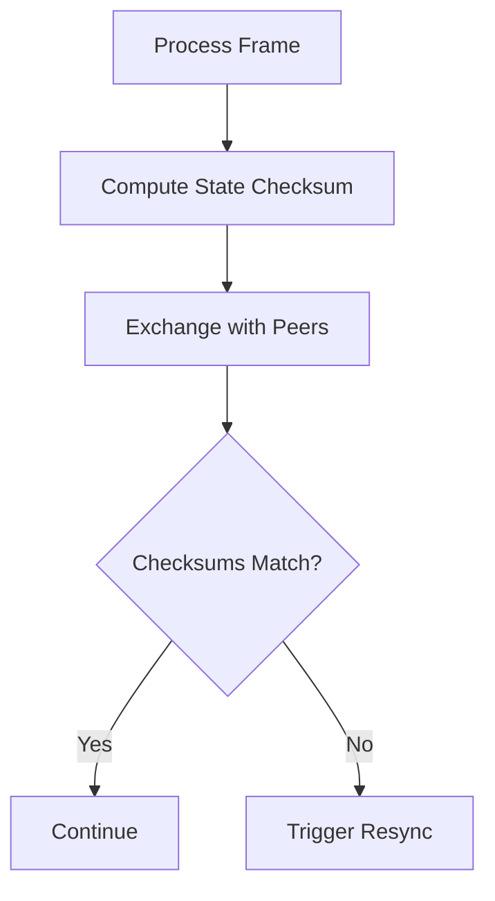

# Production Rollback Features

## Overview

The current [`RollbackClient`](packages/netcode/src/strategies/rollback.ts) is a basic GGPO-style implementation. Production rollback netcode needs input prediction for remote players, checksum validation to detect desyncs, and smarter input delay management.

## Current State

The existing implementation in [`rollback.ts`](packages/netcode/src/strategies/rollback.ts) has:

- Local input history and state history
- Basic rollback and resimulation on late inputs
- Fixed input delay

## Missing Features

### 1. Input Prediction for Remote Players

- When remote input hasn't arrived, predict it (usually: repeat last input)
- Track prediction accuracy and adjust strategy
- Mark frames as "predicted" vs "confirmed"

### 2. Desync Detection

- Compute deterministic checksum of world state each frame
- Exchange checksums between clients periodically
- When checksums diverge, trigger full state sync or disconnect

### 3. Dynamic Input Delay

- Measure round-trip time to each peer
- Adjust input delay based on network conditions
- Balance responsiveness vs rollback frequency

### 4. Rollback Limits

- Cap maximum rollback frames (e.g., 7 frames)
- If rollback would exceed limit, pause/slow simulation
- Prevents wild corrections from massive lag spikes

## Key Changes to RollbackClient

- Add `predictRemoteInput(playerId, frame)` method
- Add `computeChecksum(world)` callback in config
- Add `onDesync` callback for handling divergence
- Track `confirmedFrame` vs `predictedFrame` distinction
- Add adaptive input delay based on RTT measurements