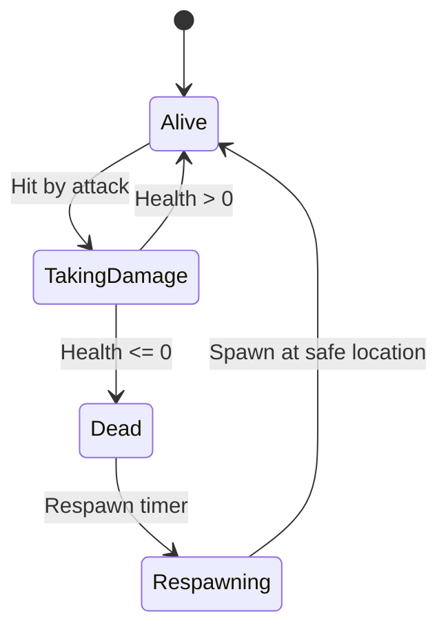

# Real Game Features

## Overview

Transform the platformer tech demo into an actual playable game with player-vs-player interactions, game state management, and win/lose conditions.

## Feature Areas

### 1. Player Collision Detection

- AABB collision between players
- Push-out resolution (players can't overlap)
- Add to [`simulatePlatformer`](packages/netcode/src/examples/platformer/simulation.ts)

### 2. Combat System

- Health per player (add to `PlatformerPlayer` in [`types.ts`](packages/netcode/src/examples/platformer/types.ts))
- Attack action with hitbox (ties into Lag Compensation plan)
- Damage calculation and knockback
- Death and respawn logic



### 3. Game State Machine

- Lobby (waiting for players)
- Countdown (game starting)
- Playing (active game)
- GameOver (winner determined)
- Add `GameState` to `PlatformerWorld`

### 4. Win Conditions

- Last player standing
- Most kills in time limit
- First to X kills

**Configuration**: Win condition is set via `MatchConfig` passed to server on game start:

```typescript
interface MatchConfig {
  winCondition: 'last_standing' | 'most_kills' | 'first_to_x';
  killTarget?: number;    // For 'first_to_x'
  timeLimitMs?: number;   // For 'most_kills'
}
```

**Detection**: Server checks win condition in `tick()` after processing combat. When triggered, sets `gameState: 'gameover'` and `winner` field, then broadcasts final snapshot.

### 5. Level Design

- Platform definitions (position, size)
- Spawn points
- Hazards (spikes, pits)
- Load from JSON config

### 6. UI/UX in App

- Health bars above players
- Kill feed
- Scoreboard
- Game state overlay (countdown, winner)
- Update [`canvas-renderer.ts`](packages/app/src/client/renderer/canvas-renderer.ts)

## World State Changes

```typescript
interface PlatformerPlayer {
  // existing fields...
  health: number;          // Current health, clamped to [0, maxHealth]
  maxHealth: number;       // Maximum health (no overheal)
  deaths: number;
  kills: number;           // Incremented for final blow only (no assists)
  lastHitBy: string | null;
  respawnTimer: number | null;  // When non-null, player is invulnerable and cannot act
}

interface PlatformerWorld {
  // existing fields...
  gameState: 'lobby' | 'countdown' | 'playing' | 'gameover';
  platforms: Platform[];
  winner: string | null;
  matchConfig: MatchConfig;
}
```

**Guardrails**:

- Health is clamped: `health = Math.max(0, Math.min(maxHealth, newHealth))`
- Respawn invulnerability: While `respawnTimer !== null`, player cannot take damage
- Kill attribution: Only the `lastHitBy` player gets the kill when `health <= 0`