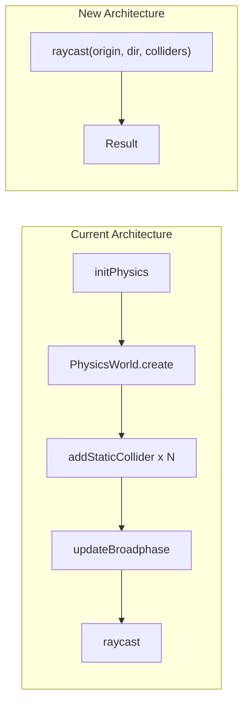

# Remove Rapier and Implement Stateless Raycasting

## Problem

The current implementation uses Rapier (`@dimforge/rapier2d-compat`) which has architectural issues for netcode:

1. **Stateful World**: `PhysicsWorld` maintains internal state that must be synchronized
2. **Async Initialization**: Requires `await initPhysics()` before any simulation
3. **WASM Dependency**: Adds complexity and bundle size (~500KB WASM)
4. **Broadphase Quirk**: Must call `updateBroadphase()` after adding colliders

## Solution

Implement a stateless raycasting system where collision geometry is passed as function arguments each frame. No persistent physics state, no async initialization.



## Key Changes

### 1. Replace `world.ts` with Stateless Raycasting

Remove the `PhysicsWorld` class entirely. Replace with pure functions:

```typescript
// New API - no world, no state
export function raycast(
  origin: Vector2,
  direction: Vector2,
  maxDistance: number,
  colliders: readonly Collider[],
): RaycastHit | null;
```

The `Collider` type represents static geometry (AABB):

```typescript
interface Collider {
  readonly position: Vector2;  // Center position
  readonly halfExtents: Vector2;
  readonly oneWay?: boolean;
  readonly tag?: string;
}
```

### 2. Implement Ray-AABB Intersection

Ray-AABB intersection is well-established math (slab method):

```typescript
function rayAABBIntersection(
  rayOrigin: Vector2,
  rayDirection: Vector2,
  boxCenter: Vector2,
  boxHalfExtents: Vector2,
): { distance: number; normal: Vector2 } | null;
```

Reference: [Ray-AABB intersection](https://tavianator.com/2011/ray_box.html)

### 3. Update CharacterController

Change the constructor to accept a collider array instead of `PhysicsWorld`:

```typescript
// Before
constructor(world: PhysicsWorld, options: {...})

// After  
constructor(colliders: readonly Collider[], options: {...})
```

All internal raycast calls change from `this.world.raycast(...)` to `raycast(..., this.colliders)`.

### 4. Update physics-bridge.ts

The bridge becomes much simpler - no more caching worlds or async initialization:

```typescript
// Before
export async function initPlatformerPhysics(): Promise<void> {...}
export function getPhysicsWorldForLevel(level: LevelConfig): PhysicsWorld {...}

// After (synchronous, stateless)
export function getLevelColliders(level: LevelConfig): Collider[] {...}
```

### 5. Remove Async Initialization

Remove all `beforeAll(async () => { await initPhysics(); })` from test files:

- [packages/physics2d/src/world.test.ts](packages/physics2d/src/world.test.ts)
- [packages/physics2d/src/controller.test.ts](packages/physics2d/src/controller.test.ts)
- [examples/platformer/simulation.test.ts](examples/platformer/simulation.test.ts)
- [packages/netcode/src/client/prediction.test.ts](packages/netcode/src/client/prediction.test.ts)
- [packages/netcode/src/client/reconciliation.test.ts](packages/netcode/src/client/reconciliation.test.ts)
- [packages/netcode/src/integration.test.ts](packages/netcode/src/integration.test.ts)
- [packages/netcode/src/server/game-loop.test.ts](packages/netcode/src/server/game-loop.test.ts)
- [packages/netcode/src/strategies/server-authoritative.test.ts](packages/netcode/src/strategies/server-authoritative.test.ts)

### 6. Remove Rapier Dependency

- Remove `@dimforge/rapier2d-compat` from [packages/physics2d/package.json](packages/physics2d/package.json)
- Run `bun install` to update lockfile

## Files to Modify

| File | Changes |

|------|---------|

| [packages/physics2d/src/world.ts](packages/physics2d/src/world.ts) | Replace entirely with stateless raycast functions |

| [packages/physics2d/src/controller.ts](packages/physics2d/src/controller.ts) | Accept colliders array, use new raycast API |

| [packages/physics2d/src/types.ts](packages/physics2d/src/types.ts) | Add `Collider` type, remove `ColliderData` |

| [packages/physics2d/src/index.ts](packages/physics2d/src/index.ts) | Update exports |

| [examples/platformer/physics-bridge.ts](examples/platformer/physics-bridge.ts) | Simplify to collider conversion |

| [examples/platformer/simulation.ts](examples/platformer/simulation.ts) | Pass colliders to CharacterController |

| All test files | Remove async initialization |

## What Stays the Same

- **math.ts**: All vector math utilities remain unchanged
- **types.ts**: `Vector2`, `RaycastHit`, `CollisionInfo`, `ControllerConfig` stay the same
- **controller.ts**: Core logic (slope handling, one-way platforms) stays the same, just uses new raycast
- **Test behavior**: All existing test assertions remain valid

## Performance Consideration

Without Rapier's BVH (broadphase), raycasting is O(n) where n = number of colliders. For typical platformer levels (10-50 platforms), this is negligible. If needed later, a simple spatial grid can be added as an optimization.

## Benefits

1. **Truly Stateless**: Each simulation tick is completely independent
2. **No Async**: No WASM loading, synchronous initialization
3. **Smaller Bundle**: Remove ~500KB WASM dependency
4. **Simpler Tests**: No `beforeAll` hooks needed
5. **Debuggable**: Pure TypeScript, easy to step through