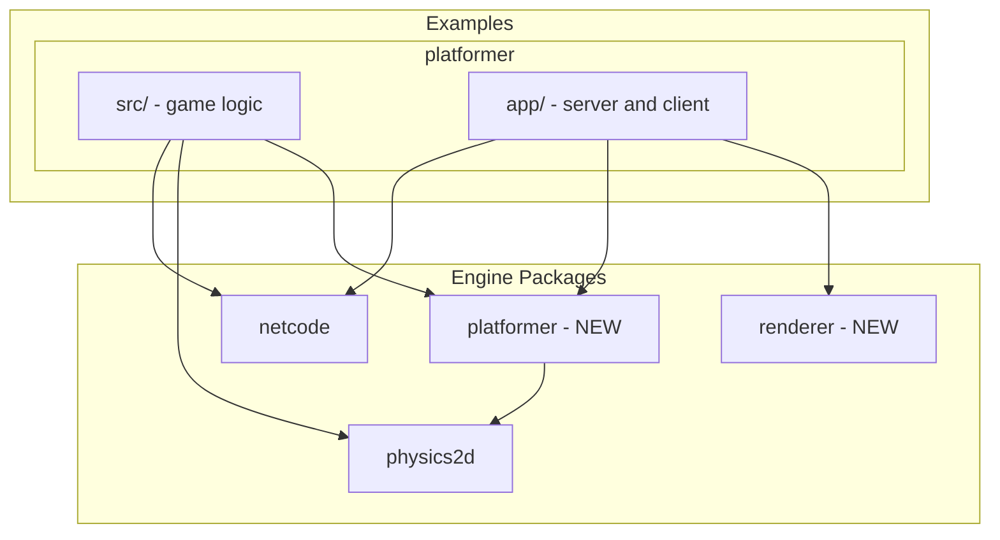

# Monorepo Architecture Restructuring

## Current Problems

1. `packages/app/` is platformer-specific but lives alongside generic packages
2. Renderer code is tightly coupled to platformer types
3. Platformer movement helpers (variable jump, wall slide) could be engine-level
4. Type duplication (`Vector2` defined in both physics2d and platformer)

## Target Architecture



## Package Responsibilities

### `packages/renderer/` (NEW)

Generic rendering infrastructure:

- Base `Renderer` interface
- Coordinate system utilities (Y-up, center origin)
- Debug visualization (position trails, ghost entities, legend)
- PixiJS initialization helpers

### `packages/platformer/` (NEW)

Reusable platformer genre helpers:

- Movement system (`updatePlayerMovement`, variable jump, wall slide, wall jump)
- `PlayerConfig` and `DerivedPhysics` types
- Movement state management
- Platform types (solid, one-way, moving - future)

### `examples/platformer/` (RESTRUCTURED)

Complete platformer game example:

- `src/` - Game logic (combat, projectiles, game states, levels)
- `app/` - Runnable application (moved from `packages/app/`)
  - Server
  - Client (React app, socket handling)
  - Platformer-specific renderer implementation

## File Changes

### 1. Create `packages/renderer/`

```
packages/renderer/
  package.json
  src/
    index.ts
    types.ts           - PositionHistoryEntry, DebugData, base RenderOptions
    debug.ts           - Debug visualization utilities
    pixi/
      index.ts
      init.ts          - PixiJS Application + Viewport initialization
      coordinates.ts   - Y-up coordinate system helpers
```

### 2. Create `packages/platformer/`

Move from `examples/platformer/`:

- `player.ts` -> `packages/platformer/src/movement.ts`
- Movement-related types from `types.ts`
```
packages/platformer/
  package.json
  src/
    index.ts
    movement.ts        - updatePlayerMovement, derivePhysics
    types.ts           - PlayerConfig, DerivedPhysics, PlayerMovementState
```


### 3. Restructure `examples/platformer/`

Move `packages/app/` contents:

```
examples/platformer/
  package.json         - UPDATE: add app dependencies
  src/                 - Game logic (existing, minus player.ts movement code)
    index.ts
    types.ts           - Game-specific types (combat, projectiles, match)
    simulation.ts
    interpolation.ts
    levels.ts
    action-validator.ts
  app/                 - NEW: moved from packages/app
    package.json
    src/
      server.ts
      client/
        app.tsx
        index.html
        socket.ts
        renderer/
          platformer-renderer.ts  - Game-specific PixiJS renderer
      game/
        game-client.ts
```

### 4. Delete `packages/app/`

After moving contents to `examples/platformer/app/`.

### 5. Fix Type Duplication

Remove `Vector2` from `examples/platformer/src/types.ts`, import from `@game/physics2d` everywhere.

## Import Changes

Before:

```typescript
import { PlatformerPlayer } from "@game/example-platformer";
import { CharacterController } from "@game/physics2d";
```

After:

```typescript
import { updatePlayerMovement, PlayerConfig } from "@game/platformer";
import { CharacterController } from "@game/physics2d";
import { DebugData, initPixiApp } from "@game/renderer";
// Game-specific imports from local src/
import { PlatformerPlayer, Projectile } from "../src/types.js";
```

## Migration Order

1. Create `packages/renderer/` with extracted generic code
2. Create `packages/platformer/` with movement system
3. Update `examples/platformer/src/` to use new packages
4. Move `packages/app/` to `examples/platformer/app/`
5. Update all imports and package.json dependencies
6. Delete `packages/app/`
7. Update root package.json scripts
8. Run tests and fix any issues

## Breaking Changes

- `@game/app` package removed
- `@game/example-platformer` renamed/restructured
- Movement code moved from example to `@game/platformer`