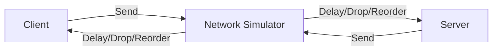

# Testing and Observability

## Overview

Real-world networks have latency, jitter, and packet loss. This plan adds tools to simulate these conditions, measure performance, and visualize what the netcode is doing.

## Feature Areas

### 1. Network Condition Simulator

Create a middleware layer that can inject network problems:

- **Latency**: Add fixed or variable delay (e.g., 50-150ms)
- **Jitter**: Randomize delay within range
- **Packet loss**: Drop X% of messages
- **Packet reordering**: Deliver out of order
- **Bandwidth limit**: Throttle message rate

### 2. Integration Test Harness

Extend [`integration.test.ts`](packages/netcode/src/integration.test.ts) with:

- Tests under simulated latency (100ms, 200ms, 500ms)
- Tests under packet loss (1%, 5%, 10%)
- Tests under jitter conditions
- Verify prediction/reconciliation still works correctly

### 3. Performance Benchmarks

- Measure tick processing time under load (10, 50, 100 players)
- Measure snapshot serialization size
- Measure memory usage of snapshot buffer
- Track over time to catch regressions

### 4. Debug Visualization (enhance existing)

Current [`canvas-renderer.ts`](packages/app/src/client/renderer/canvas-renderer.ts) has some debug features. Add:

- **Prediction error graph**: Show misprediction magnitude over time
- **Network stats overlay**: RTT, packet loss, jitter
- **Input timeline**: Visualize input -> ack -> reconciliation flow
- **Snapshot timeline**: Show received snapshots and interpolation window

### 5. Logging and Metrics

- Structured logging for key events (input sent, snapshot received, reconciliation triggered)
- Metrics export (could use simple JSON endpoint)
- Replay recording: save inputs + snapshots for replay/debugging

## Implementation Location

- Network simulator: new [`packages/netcode/src/testing/`](packages/netcode/src/testing/) directory
- Benchmarks: new `packages/netcode/src/*.bench.ts` files (Bun supports benchmarks)
- Debug viz: extend existing renderer in [`packages/app/`](packages/app/src/client/renderer/)