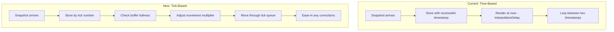

# Tick-Based Interpolation Implementation

This plan implements FishNet-style tick-based smoothing to replace the current time-based interpolation. The key insight from FishNet is that interpolation should work in **tick-space** (discrete simulation steps) rather than wall-clock time, with adaptive buffer management to self-correct for network jitter.

## Architecture Overview



## Key Concepts from FishNet

1. **Tick Queue**: Store transform properties per tick, not per timestamp
2. **Interpolation Value**: Target number of ticks to buffer (adaptive based on RTT)
3. **Movement Multiplier**: Speed up/slow down consumption based on buffer fullness (0.95x - 1.05x)
4. **Ease-In Corrections**: During reconciliation replay, lerp toward corrected positions rather than snapping

## Implementation Plan

### Phase 1: Create TickInterpolator Class

Create a new [packages/netcode/src/client/tick-interpolator.ts](packages/netcode/src/client/tick-interpolator.ts) that replaces the time-based `Interpolator`:

```ts
interface TickTransformProperties<TWorld> {
  tick: number;
  state: TWorld;
}

interface TickInterpolatorConfig {
  /** Target ticks to buffer (default: 3) */
  interpolationTicks: number;
  /** Tick interval in ms (must match server) */
  tickIntervalMs: number;
  /** Max entries over interpolation before discarding (default: 3) */
  maxOverBuffer: number;
  /** Enable adaptive interpolation based on RTT */
  adaptiveInterpolation: boolean;
}
```

Key methods:

- `addSnapshot(snapshot: Snapshot<TWorld>)` - Add by tick number
- `getInterpolatedState(deltaMs: number)` - Returns interpolated state, consuming buffer based on delta
- `onReconciliationReplay(tick: number, newState: TWorld)` - Ease-in corrections to queued states
- `updateAdaptiveInterpolation(rttMs: number)` - Adjust target buffer based on RTT

### Phase 2: Implement Buffer Management

The core innovation - adjust consumption speed based on buffer fullness:

```ts
private setMovementMultiplier(): void {
  const overInterpolation = this.queue.length - this.targetInterpolation;
  
  if (overInterpolation !== 0) {
    // Speed up/slow down by 1.5% per extra/missing entry
    this.movementMultiplier += 0.015 * overInterpolation;
  }
  
  // Clamp to reasonable range
  this.movementMultiplier = Math.max(0.95, Math.min(1.05, this.movementMultiplier));
}
```

This self-corrects for:

- Network jitter (bursts of packets)
- Temporary packet loss
- Clock drift between client and server

### Phase 3: Implement Ease-In for Reconciliation

When reconciliation replays inputs, instead of snapping the interpolation buffer, ease corrections in:

```ts
onReconciliationReplay(tick: number, correctedState: TWorld): void {
  const index = this.findTickIndex(tick);
  if (index < 0) return;
  
  // Calculate ease percent based on position in queue
  const queueLength = this.queue.length;
  const easePercent = Math.min(1, index / (queueLength - 1));
  
  // Apply eased correction (more correction for entries closer to "now")
  const oldState = this.queue[index].state;
  const easedState = this.interpolate(oldState, correctedState, easePercent);
  this.queue[index] = { tick, state: easedState };
}
```

### Phase 4: Update Reconciler Integration

Modify [packages/netcode/src/client/reconciliation.ts](packages/netcode/src/client/reconciliation.ts) to notify the tick interpolator during replay:

```ts
// In reconcile(), after replaying each input:
for (const inputMsg of unacknowledged) {
  this.predictor.applyInputWithDelta(inputMsg.input, this.tickIntervalMs);
  
  // Notify interpolator to ease-in the correction at this tick
  if (this.tickInterpolator) {
    const currentTick = snapshot.tick + replayIndex;
    this.tickInterpolator.onReconciliationReplay(
      currentTick,
      this.predictor.getState()
    );
  }
}
```

### Phase 5: Update ServerAuthoritativeClient

Modify [packages/netcode/src/strategies/server-authoritative.ts](packages/netcode/src/strategies/server-authoritative.ts):

1. Replace `Interpolator` with `TickInterpolator`
2. Pass tick interval from constructor
3. Update `getStateForRendering()` to use new interpolation API
4. Wire up reconciliation replay callbacks

### Phase 6: Keep VisualSmoother as Final Polish

The existing `VisualSmoother` remains as a final layer for any residual micro-corrections. The tick-based interpolation handles the bulk of smoothing; visual smoother catches edge cases.

### Phase 7: Comprehensive Tests

Create [packages/netcode/src/client/tick-interpolator.test.ts](packages/netcode/src/client/tick-interpolator.test.ts) covering:

- Buffer management (add, discard excess, size limits)
- Movement multiplier calculation (speeds up when full, slows when empty)
- Ease-in corrections (verify lerp percentages)
- Adaptive interpolation (RTT affects target buffer)
- Edge cases (empty buffer, single snapshot, tick gaps)

## Files to Modify

| File | Change |

|------|--------|

| `packages/netcode/src/client/tick-interpolator.ts` | **NEW** - Core tick-based interpolation |

| `packages/netcode/src/client/tick-interpolator.test.ts` | **NEW** - Tests |

| `packages/netcode/src/client/reconciliation.ts` | Add interpolator callback during replay |

| `packages/netcode/src/strategies/server-authoritative.ts` | Use TickInterpolator |

| `packages/netcode/src/client/index.ts` | Export new class |

| `packages/netcode/src/constants.ts` | Add `DEFAULT_INTERPOLATION_TICKS` |

## Migration Strategy

1. Create `TickInterpolator` alongside existing `Interpolator`
2. Add feature flag to `ServerAuthoritativeClient` to choose implementation
3. Test with Rounds example
4. Once verified, make tick-based the default
5. Deprecate time-based `Interpolator` (keep for backward compatibility)

## Key Differences from Current Implementation

| Aspect | Current (Time-Based) | New (Tick-Based) |

|--------|---------------------|------------------|

| Storage | By `receivedAt` timestamp | By server tick number |

| Render target | `now - interpolationDelayMs` | Next tick in queue |

| Speed control | Fixed | Adaptive (0.95x - 1.05x) |

| Reconciliation | Snap + visual smooth | Ease-in corrections |

| Buffer size | Time window | Tick count |

## Success Criteria

- No visible jitter on localhost (currently observable)
- Smooth corrections during reconciliation
- Self-correcting buffer under network jitter
- All existing tests pass
- New comprehensive tests for tick interpolator