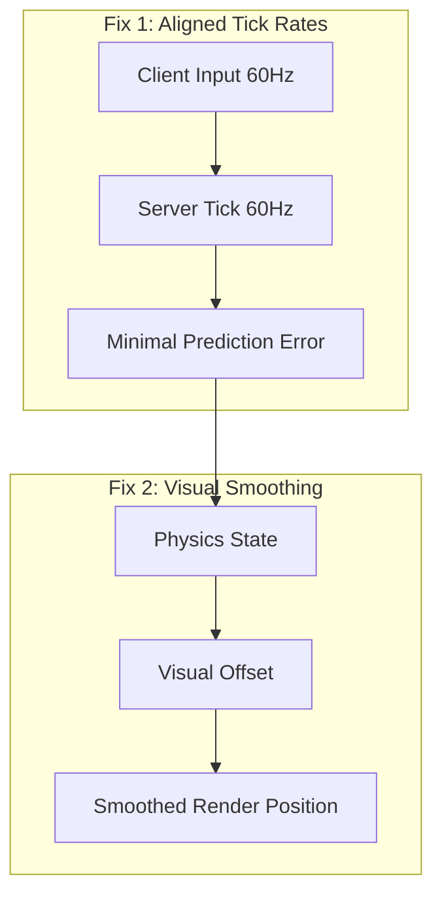
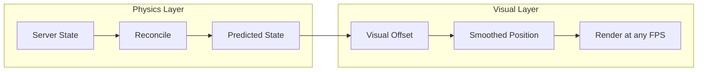

# Visual Smoothing and Tick Rate Improvements

## Problems

### Problem 1: Tick Rate Mismatch

- Client sends inputs at 60Hz (~16.67ms intervals)
- Server processes at 20Hz (50ms ticks)
- Per server tick: ~3 client inputs arrive, server simulates 50ms, client predicted 3x16ms = 48ms
- Result: ~2ms timing error per tick, accumulating into visible snapping

### Problem 2: Reconciliation Snapping

When reconciliation occurs, the client snaps from its predicted position to the server's authoritative position. Even small corrections (0.5-2 units) happening every ~50ms cause visible jerkiness.

## Solution Overview



## Part 1: Tick Rate Alignment

### Change Default Tick Rate

In [packages/netcode/src/constants.ts](packages/netcode/src/constants.ts):

```typescript
// Before
export const DEFAULT_TICK_INTERVAL_MS = 50; // 20 TPS

// After  
export const DEFAULT_TICK_INTERVAL_MS = 16; // ~60 TPS (actually 62.5 TPS)
// Or use Math.round(1000/60) = 17 for closer to 60 TPS
```

This aligns server simulation with client input rate, dramatically reducing prediction errors.

### Keep Configurable

Games can still override:

- 30 TPS for turn-based or slower games
- 128 TPS for competitive shooters
- etc.

## Part 2: Visual Smoothing

Even with aligned tick rates, minor errors will occur due to network jitter. Visual smoothing handles the remaining corrections gracefully.

### Architecture

Separate **physics state** (authoritative) from **rendered position** (smoothed):



### New Class: VisualSmoother

Create [packages/netcode/src/client/visual-smoother.ts](packages/netcode/src/client/visual-smoother.ts):

```typescript
interface VisualSmootherConfig {
  // How quickly to blend toward physics position (0 = instant, 1 = never)
  // Higher values = smoother but more visual lag
  smoothFactor: number;  // default: 0.9
  
  // Above this threshold, snap immediately (for teleports/respawns)
  snapThreshold: number; // default: 50 units
}

class VisualSmoother {
  private offsetX: number = 0;
  private offsetY: number = 0;
  
  // Called when reconciliation causes a position change
  onReconciliationSnap(deltaX: number, deltaY: number): void;
  
  // Called every frame with frame delta (works at any FPS)
  update(deltaTimeMs: number): void;
  
  // Get current visual offset to apply to physics position
  getOffset(): { x: number; y: number };
}
```

Key behavior:

- `onReconciliationSnap(dx, dy)`: Accumulates offset when physics position jumps
- `update(dt)`: Exponentially decays offset toward zero (frame-rate independent)
- Clients at 60fps, 120fps, or 240fps all get smooth results

### Integration Points

1. **[packages/netcode/src/client/reconciliation.ts](packages/netcode/src/client/reconciliation.ts)**

   - Capture position before/after reconciliation
   - Report delta to VisualSmoother

2. **[packages/netcode/src/strategies/server-authoritative.ts](packages/netcode/src/strategies/server-authoritative.ts)**

   - Integrate VisualSmoother
   - `getStateForRendering()` applies smoothed offset

3. **[packages/netcode/src/create-client.ts](packages/netcode/src/create-client.ts)**

   - Add `visualSmoothing` config option

## Files to Modify

| File | Change |

|------|--------|

| [packages/netcode/src/constants.ts](packages/netcode/src/constants.ts) | Change `DEFAULT_TICK_INTERVAL_MS` to 16ms |

| [packages/netcode/src/client/visual-smoother.ts](packages/netcode/src/client/visual-smoother.ts) | **New file** - VisualSmoother class |

| [packages/netcode/src/client/reconciliation.ts](packages/netcode/src/client/reconciliation.ts) | Report position deltas to smoother |

| [packages/netcode/src/strategies/server-authoritative.ts](packages/netcode/src/strategies/server-authoritative.ts) | Integrate smoother into rendering |

| [packages/netcode/src/create-client.ts](packages/netcode/src/create-client.ts) | Add visualSmoothing config |

| [packages/netcode/src/client/index.ts](packages/netcode/src/client/index.ts) | Export VisualSmoother |

| [examples/rounds/app/src/server.ts](examples/rounds/app/src/server.ts) | Use explicit 60 TPS |

| Tests | Unit tests for VisualSmoother |

## Configuration

```typescript
const client = createClient({
  // ... existing options
  tickIntervalMs: 16,  // Match server (default: 16ms / 60 TPS)
  visualSmoothing: {
    enabled: true,           // default: true
    smoothFactor: 0.9,       // default: 0.9
    snapThreshold: 50,       // default: 50 units
  },
});
```

## Why This Works

1. **60 TPS alignment** eliminates most prediction errors at the source
2. **Visual smoothing** handles any remaining small corrections gracefully  
3. **Frame-rate independent** decay ensures smooth results at 60/120/240fps
4. **Snap threshold** allows instant teleports when needed
5. **Configurable** for different game requirements