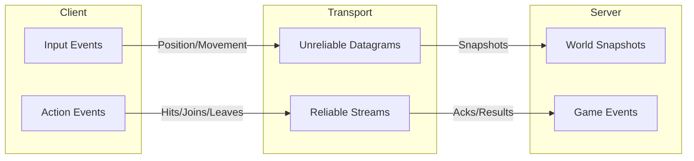

# WebTransport Integration

## Overview

WebTransport provides lower latency than WebSocket with support for unreliable datagrams (no head-of-line blocking) and multiple streams. This is ideal for real-time games where stale position data should be dropped rather than queued.

## Architecture

## Channel Strategy

| Data Type | Channel | Reason |

|-----------|---------|--------|

| Input messages | Unreliable datagram | Stale inputs are useless |

| World snapshots | Unreliable datagram | Latest state matters most |

| Player join/leave | Reliable stream | Must not be lost |

| Action events (shoot) | Reliable stream | Must be processed |

| Action results | Reliable stream | Player needs feedback |

## Key Components

### 1. Transport Abstraction Layer

- Create `Transport` interface in new [`packages/netcode/src/transport/`](packages/netcode/src/transport/)
- Implement `SocketIOTransport` (current behavior)
- Implement `WebTransportTransport` (new)
- Allow swapping transports without changing game code

### 2. Server Setup

- Bun supports WebTransport via `Bun.serve()` with HTTP/3
- Requires TLS certificates (self-signed for dev)
- Fallback to WebSocket for browsers without WebTransport support

### 3. Client Setup

- Use native `WebTransport` API
- Handle connection lifecycle (connect, disconnect, reconnect)
- Manage datagram vs stream sending

### 4. Serialization

- Datagrams need compact binary format (consider MessagePack or custom)
- Include sequence numbers for ordering/staleness detection

## Considerations

- **Browser support**: WebTransport is Chrome 97+, need fallback
- **TLS requirement**: WebTransport requires HTTPS, complicates local dev
- **Bun support**: Verify Bun's WebTransport server capabilities